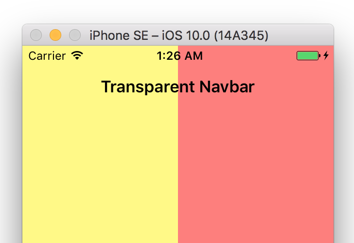

# Swift3 iOS Transparent UINavigationBar Example

There are probably a number of ways to do this, but one simple way to make a navbar transparent is to add the following code to each view controller:

```swift
    override func viewWillAppear(_ animated: Bool) {
        super.viewWillAppear(animated)
        if let nav = self.navigationController?.navigationBar {
            nav.setBackgroundImage(UIImage(), for: .default)
            nav.shadowImage = UIImage()
            nav.isTranslucent = true
        }
    }
```

The result should look like this (two color background is to illustrate the transparency):

